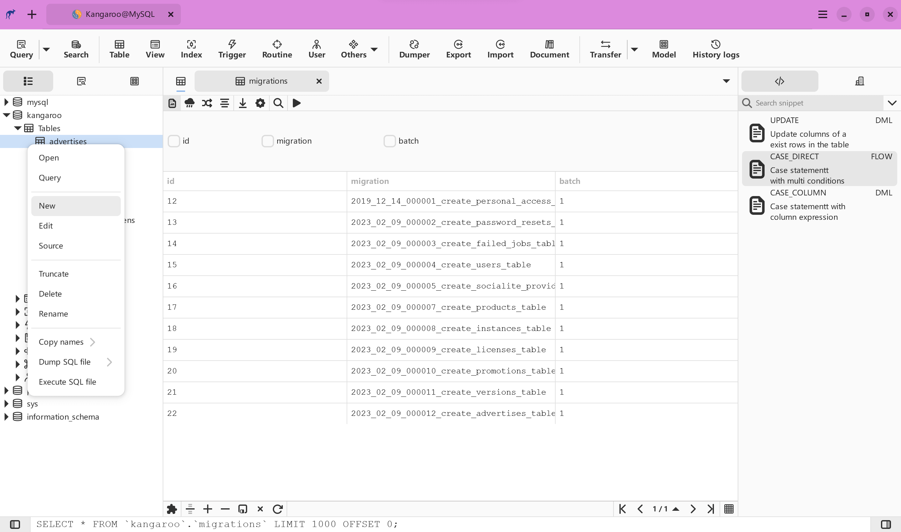

  

    <h2>Simple & Powerful</h2>
    
Simple and Intuitive GUI helps you focus on data and finishing your work quickly.

  

  

    <h2>Great Experience</h2>
    
Focus on the experience of editting, make you feel smoothly when working with it.

  

  

    <h2>Performance</h2>
    
<a target="_blank" href="https://gitlab.gnome.org/GNOME/vala">Vala</a>, <a target="_blank" href="https://www.gtk.org/">GTK3</a> and <a target="_blank" href="https://gitlab.gnome.org/GNOME/libgda">libgda</a> based native application, more responsible speed than others.

  

## Support database
Database support capability level: __Planned__ / __Partial__ / __Full(:100:)__

| Database    | Version | Query     | Editing   | Designer  | Export    | Import    | Hint      | Modeling | DB Sync |
|-------------|---------|-----------|-----------|-----------|-----------|-----------|-----------|----------|---------|
| SQLite      | 3.0 +   | Full:100: | Full:100: | Full:100: | Full:100: | Full:100: | Full:100: | in progress  | Planned |
| MySQL       | 5.5 +   | Full:100: | Full:100: | Full:100: | Full:100: | Full:100: | Full:100: | in progress  | Planned |
| MariaDB     | 10.0 +  | Full:100: | Full:100: | Full:100: | Full:100: | Full:100: | Full:100: | in progress  | Planned |
| PostgreSQL  | 9.0 +   | Full:100: | Full:100: | Full:100: | Full:100: | Full:100: | Full:100: | in progress  | Planned |
| Redis       |         | Planned   | Planned   | Planned   | Planned   | Planned   | Planned   | Planned  | Planned |
| Oracle      |         |           |           |           |           |           |           |          |         |
| SQL Server  |         |           |           |           |           |           |           |          |         |

**Hint**: Code intellisense or Code autocomplete

    <script2 type="text/javascript" async="true" src="https://pagead2.googlesyndication.com/pagead/js/adsbygoogle.js" />
    <ins class="adsbygoogle"
        style="display:block; text-align:center;"
        data-ad-layout="in-article"
        data-ad-format="fluid"
        data-ad-client="ca-pub-3975819313740938"
        data-ad-slot="6760827895"></ins>
    <script2 type="text/javascript">
        (adsbygoogle = window.adsbygoogle || []).push({});
    </script2>

## Release
Development version will be released weekly, Stable and LTS(Long-term Support) version depend on test result and stabilization.

| Platform    | Windows(64 bit)   | Linux(64 bit)     | MacOS(64 bit)   |
|-------------|-------------------|-------------------|-----------------|
| Stable      | [Kangaroo 2020(Beta 6)](./en/download/v1.0.6.201109) | [Kangaroo 2020(Beta 6)](./en/download/v1.0.6.201109) | [Kangaroo 2020(Beta 6)](./en/download/v1.0.6.201109) |
| Development | [Kangaroo 2021(Preview 2)](./en/download/v1.5.1.201231) | [Kangaroo 2021(Preview 2)](./en/download/v1.5.1.201231) | [Kangaroo 2021(Preview 2)](./en/download/v1.5.1.201231) |

## Support the Project
If you like Kangaroo and you want to support its development, you could __buy me a coffee__ or __scan QR code__ to donate via PayPal / Wechat / Alipay. 
 

## Screenshots

    <ins class="adsbygoogle"
        style="display:block; text-align:center;"
        data-ad-layout="in-article"
        data-ad-format="fluid"
        data-ad-client="ca-pub-3975819313740938"
        data-ad-slot="6760827895"></ins>
    <script2 type="text/javascript">
        (adsbygoogle = window.adsbygoogle || []).push({});
    </script2>

    <ins class="adsbygoogle"
        style="display:block; text-align:center;"
        data-ad-layout="in-article"
        data-ad-format="fluid"
        data-ad-client="ca-pub-3975819313740938"
        data-ad-slot="6760827895"></ins>
    <script2 type="text/javascript">
        (adsbygoogle = window.adsbygoogle || []).push({});
    </script2>

    <a target="_blank" href="http://www.beian.gov.cn/portal/registerSystemInfo?recordcode=44030602005092">粤公网安备44030602005092号</a>
    <a target="_blank" href="http://beian.miit.gov.cn/" style="margin: 0px 10px 0px 10px;">粤ICP备2020100158号</a> Copyright © 2018-present taozuhong

