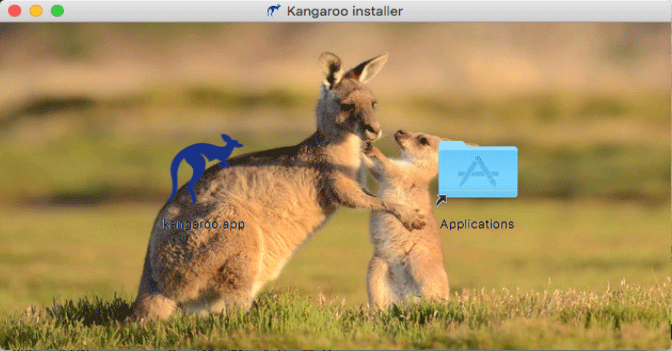

# Install on MacOS
::: danger Open a Mac app from an unidentified developer(unsigned)
To override your security settings and open the app anyway follow these steps:

1. In the Finder  on your Mac, locate the app you want to open.<br/>
   Don’t use Launchpad to do this. Launchpad doesn’t allow you to access the shortcut menu.
2. Control-click the app icon, then choose Open from the shortcut menu.
3. Click Open.<br/>
   The app is saved as an exception to your security settings, and you can open it in the future by double-clicking it just as you can any registered app.
:::

## Download Kangaroo
Download the latest version of Kangaroo from [Download](../download).

## Install Kangaroo
There are two ways to install Kangaroo on your system, the first way is DMG image, the second way is install manually.

### Installer
1. Double click to mount and open the DMG image in Finder;
2. Drag the kangaroo's icon to Application's icon to finish installation.
   
3. Launch the app from app center to make it OK

## Manual
1. Extract the app from package
``` bash
tar -xvf <Kangaroo-......tar.gz>
```
2. Double click the app to launch the app

<Vssue :issue-id="6" :title="$title" />
