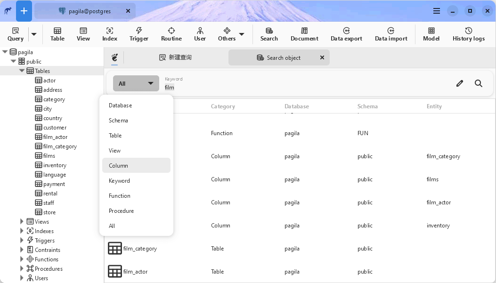
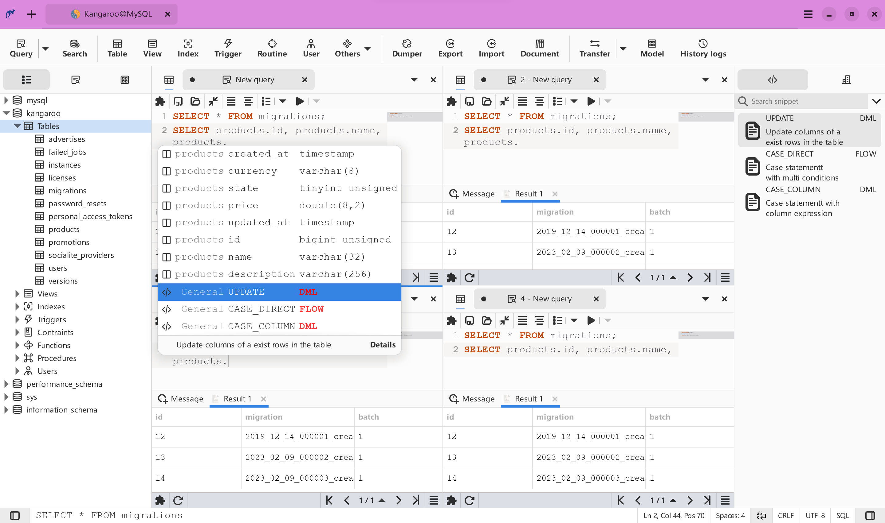

# Screenshots

    <ins class="adsbygoogle"
        style="display:block; text-align:center;"
        data-ad-layout="in-article"
        data-ad-format="fluid"
        data-ad-client="ca-pub-3975819313740938"
        data-ad-slot="6760827895"></ins>
    <script2 type="text/javascript">
        (adsbygoogle = window.adsbygoogle || []).push({});
    </script2>

    <ins class="adsbygoogle"
        style="display:block; text-align:center;"
        data-ad-layout="in-article"
        data-ad-format="fluid"
        data-ad-client="ca-pub-3975819313740938"
        data-ad-slot="6760827895"></ins>
    <script2 type="text/javascript">
        (adsbygoogle = window.adsbygoogle || []).push({});
    </script2>

    <ins class="adsbygoogle"
        style="display:block; text-align:center;"
        data-ad-layout="in-article"
        data-ad-format="fluid"
        data-ad-client="ca-pub-3975819313740938"
        data-ad-slot="6760827895"></ins>
    <script2 type="text/javascript">
        (adsbygoogle = window.adsbygoogle || []).push({});
    </script2>

    <ins class="adsbygoogle"
        style="display:block; text-align:center;"
        data-ad-layout="in-article"
        data-ad-format="fluid"
        data-ad-client="ca-pub-3975819313740938"
        data-ad-slot="6760827895"></ins>
    <script2 type="text/javascript">
        (adsbygoogle = window.adsbygoogle || []).push({});
    </script2>

    <ins class="adsbygoogle"
        style="display:block; text-align:center;"
        data-ad-layout="in-article"
        data-ad-format="fluid"
        data-ad-client="ca-pub-3975819313740938"
        data-ad-slot="6760827895"></ins>
    <script2 type="text/javascript">
        (adsbygoogle = window.adsbygoogle || []).push({});
    </script2>

