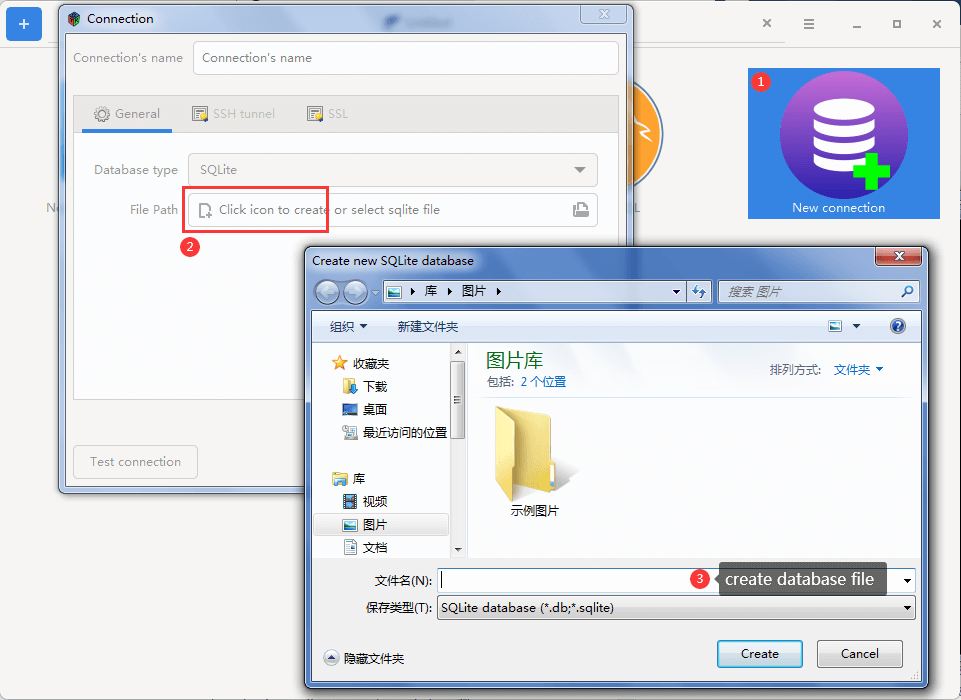

# SQLite support

## Create database connection quickly
Drag and drop a sqlite database file from file manager into connection home page, the connection is created quickly.

## Create a new database
There are two ways to create sqlite database in the Kangaroo app: 
1. Create a empty file with sqlite file extension(.db/.sqlite), then drag and drop it on the connection home page to create an connection.

2. Click the \[new connection\] button to open connection dialog, then choose SQLite database type, click the icon on the left side of file path edit control to create an new sqlite database file.

<Vssue :issue-id="11" :title="$title" />