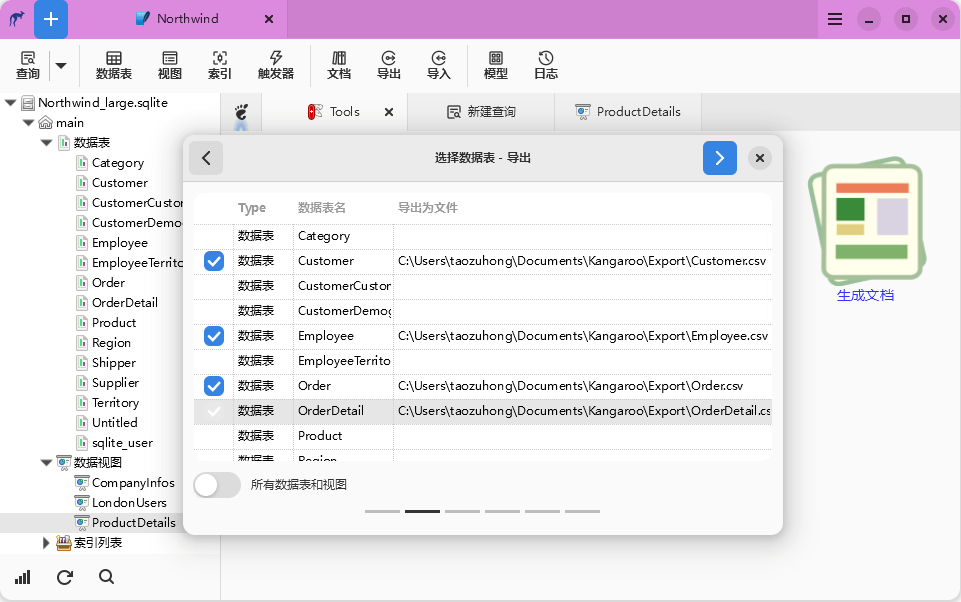
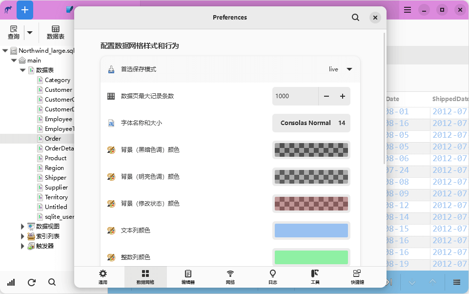

  

    <h2>简捷、强大</h2>
    
简捷、直观的操作界面，帮助您聚焦数据和快速完成工作。

  

  

    <h2>卓越体验</h2>
    
聚焦改善数据和 SQL 编辑体验, 让您完成工作的同时收获愉悦的体验。

  

  

    <h2>就是快</h2>
    
基于<a target="_blank" href="https://gitlab.gnome.org/GNOME/vala">Vala</a>、<a target="_blank" href="https://www.gtk.org/">GTK3</a> 和 <a target="_blank" href="https://gitlab.gnome.org/GNOME/libgda">libgda</a> 构建的原生应用，获得 C 语言的原生性能，就是为了快。

  

# 支持的数据库系统
数据库支持能力级别: __已计划__ / __部分__ / __支持(:100:)__

| 数据库       | 支持版本 | SQL 查询     | 数据编辑   | 表设计器  | 导出    | 导入    | 智能提示      | 模型化 | 数据同步 |
|-------------|---------|--------------|------------|----------|---------|--------|---------------|-------|---------|
| SQLite      | 3.0 +   | 支持:100: | 支持:100: | 支持:100: | 支持:100: | 支持:100: | 支持:100: | 已计划  | 已计划 |
| MySQL       | 5.5 +   | 支持:100: | 支持:100: | 支持:100: | 支持:100: | 支持:100: | 支持:100: | 已计划  | 已计划 |
| MariaDB     | 10.0 +  | 支持:100: | 支持:100: | 支持:100: | 支持:100: | 支持:100: | 支持:100: | 已计划  | 已计划 |
| PostgreSQL  | 9.0 +   | 支持:100: | 支持:100: | 支持:100: | 支持:100: | 支持:100: | 支持:100: | 已计划  | 已计划 |
| Redis       |         | 已计划   | 已计划   | 已计划   | 已计划   | 已计划   | 已计划   | 已计划  | 已计划 |
| Oracle      |         |           |           |           |           |           |           |          |         |
| SQL Server  |         |           |           |           |           |           |           |          |         |

    <ins class="adsbygoogle"
        style="display:block; text-align:center;"
        data-ad-layout="in-article"
        data-ad-format="fluid"
        data-ad-client="ca-pub-3975819313740938"
        data-ad-slot="6760827895"></ins>
    <script2 type="text/javascript">
        (adsbygoogle = window.adsbygoogle || []).push({});
    </script2>

# 版本发布
开发版本按周发布，计划一周或两周发布一个, 稳定版本和长周期支持版本(LTS) 根据版本质量评估情况不定期发布。

| 版本类型    | Windows(64 bit)   | Linux(64 bit)   | MacOS(64 bit)   |
|-------------|-------------------|-------------------|-----------------|
| 稳定版本 | [袋鼠 2020(Beta 5)](./download/v1.0.5.201019) | [袋鼠 2020(Beta 5)](./download/v1.0.5.201019) | [袋鼠 2020(Beta 5)](./download/v1.0.5.201019) |
| 开发版本 | [v0.33.1.200817](./download/v0.33.1.200817) | [v0.33.1.200817](./download/v0.33.1.200817) | [v0.33.1.200817](./download/v0.33.1.200817) |

# 支持和赞助项目
如果您觉得袋鼠数据库工具有用且愿意支持它持续丰富功能，您可以通过如下方式支持和赞助项目（点击链接或扫码即可通过 PayPal / 微信支持 / 支付宝付款）. 
  

# 工具界面快照

    <ins class="adsbygoogle"
        style="display:block; text-align:center;"
        data-ad-layout="in-article"
        data-ad-format="fluid"
        data-ad-client="ca-pub-3975819313740938"
        data-ad-slot="6760827895"></ins>
    <script2 type="text/javascript">
        (adsbygoogle = window.adsbygoogle || []).push({});
    </script2>

    <ins class="adsbygoogle"
        style="display:block; text-align:center;"
        data-ad-layout="in-article"
        data-ad-format="fluid"
        data-ad-client="ca-pub-3975819313740938"
        data-ad-slot="6760827895"></ins>
    <script2 type="text/javascript">
        (adsbygoogle = window.adsbygoogle || []).push({});
    </script2>

    <a target="_blank" href="http://beian.miit.gov.cn/">粤ICP备2020100158号</a> 版权所有 © 2018-present taozuhong

