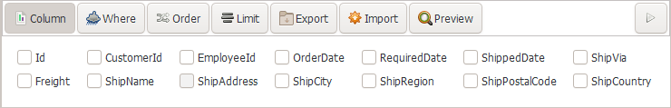

## 显示顶部的SQL构建面板

点击视图底部工具栏的 __SQL构建工具__ 图标, 可显示或隐藏 __SQL构建__ 面板，如图所示。

##  选择数据列(字段)
- 第一步: 点击 __数据列__ 按钮切换到数据列选择视图。
- 第二步: 勾选您希望显示的数据列名字。
- 第三步: 点击工具栏上最右边的三角形 __应用__ 按钮应用数据列。

## 添加查询条件
- 第一步: 点击 __条件__ 按钮切换到查询条件视图
- 第二步: 点击加号(+)按钮添加查询条件
- 第三步: 点击括号(())添加括号表达式
- 第四步: 点击 AND(与) 和 OR(或) 按钮改变条件组合方式
- 第五步: 点击工具栏上最右边的三角形 __应用__ 按钮应用查询条件

## 添加数据排序
- 第一步: 点击 __排序__ 按钮切换到排序视图
- 第二步: 点击加号(+)按钮添加排序表达式
- 第三步: 点击列名和排序方法(ASC/DESC)按钮选择排序字段和排序方法
- 第四步: 点击工具栏上最右边的三角形 __应用__ 按钮应用排序

## 添加数据行数限制
- 第一步: 点击 __行数__ 按钮切换到数据行数视图
- 第二步: 在编辑框中输入数字
- 第三步: 点击工具栏上最右边的三角形 __应用__ 按钮应用行数设置

## 切换数据编辑模式
- 第一步: 在底部工具栏上点击编辑模式按钮弹出浮窗
- 第二步: 在浮窗中选择编辑模式：即时模式、缓存模式、事务模式

<Vssue :issue-id="9" :title="$title" />
