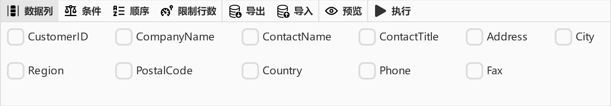
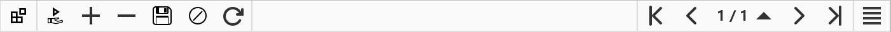

## Show the top builder pane

click __SQL builder tools__ icon in the lower left corner of workspace, then __Builder__ pane will show on the top

## Select columns
- step 1: click __Column__ button to switch to column tab
- step 2: select columns you want
- step 3: click __Apply__ button(right most) on the toolbar

## Add where statement
- step 1: click __Where__ button to switch to where tab
- step 2: click the plus button to add conditions
- step 3: then you could click bracket button to add bracket(left or right)
- step 4: add more conditions as you need.
- step 5: click __Apply__ button(right most) on the toolbar

## Add sort column
- step 1: click __Order__ button to switch to order tab
- step 2: click the plus button to add order columns
- step 3: then choose column name and order method
- step 4: click __Apply__ button(right most) on the toolbar

## Add dataset limit
- step 1: click __Limit__ button to switch to limit tab
- step 2: input page rows limit number in the entry
- step 3: click __Apply__ button(right most) on the toolbar

## Change edit mode
- step 1: click mode icon on the datagrid toolbar
- step 2: then choose mode on the pop over gui;

<Vssue :issue-id="9" :title="$title" />
